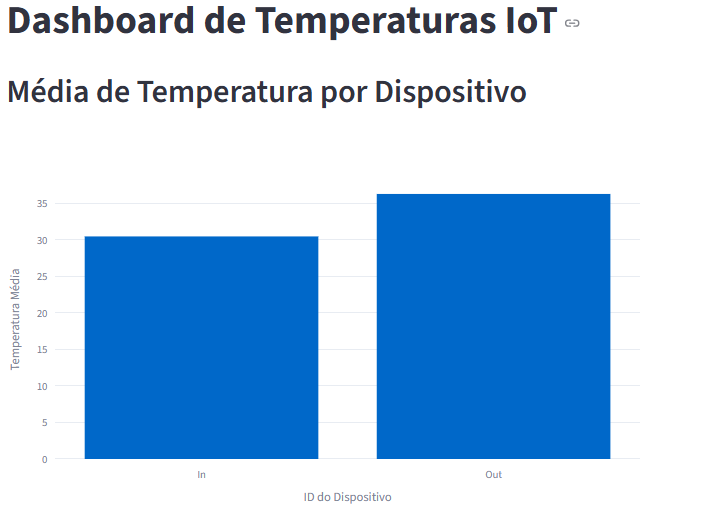
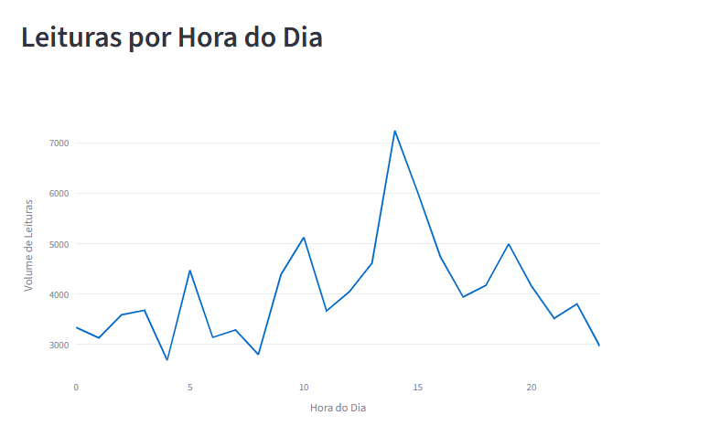
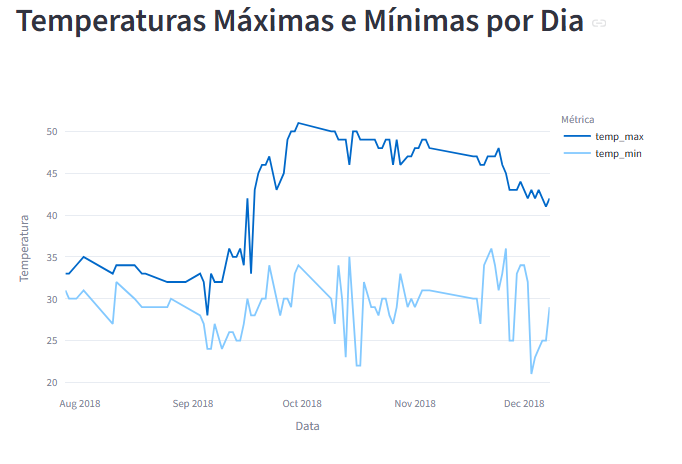

# Pipeline de Dados com IoT e Docker

Este projeto é uma Prova de Conceito (PoC) de Engenharia de Dados desenvolvida para a disciplina Disruptive Architectures: IoT, Big Data e IA. 

O objetivo é extrair dados brutos gerados por sensores IoT, processá-los utilizando Python, armazená-los numa base de dados relacional isolada em contentor (Docker + PostgreSQL) e expor métricas de negócio através de um dashboard interativo criado com Streamlit.

## Tecnologias Utilizadas

* **Linguagem:** Python 3
* **Manipulação de Dados:** Pandas
* **Base de Dados:** PostgreSQL
* **Virtualização:** Docker
* **Conexão com a Base de Dados:** SQLAlchemy & psycopg2-binary
* **Visualização de Dados:** Streamlit & Plotly
* **Versionamento:** Git e GitHub

## Fonte de Dados

Os dados brutos utilizados neste projeto simulam leituras térmicas de sensores IoT. A base de dados oficial foi extraída do Kaggle:
* **Dataset:** Temperature Readings: IoT Devices
* **Nota de Execução:** Para reproduzir o projeto, o ficheiro CSV deve ser descarregado do Kaggle e guardado no caminho `data/IOT-temp.csv`.

## Arquitetura e Modelagem de Dados (Views SQL)

O pipeline extrai os dados brutos, formata as datas e insere os registos na tabela base `temperature_readings`. Foram criadas 3 Views Analíticas na base de dados para otimizar o consumo pelo dashboard:

### 1. View: avg_temp_por_dispositivo
* **Propósito:** Calcular a média térmica captada por cada sensor. 
* **Decisão de Engenharia:** Na base original, a coluna `id` representa apenas um índice sequencial. Para gerar valor de negócio real, utilizámos a coluna `out/in` (que identifica os sensores nas áreas internas e externas) como a chave `device_id`. Isto permite uma comparação direta e legível entre a temperatura média de "Dentro" (In) vs "Fora" (Out).

### 2. View: leituras_por_hora
* **Propósito:** Analisar o volume de tráfego de dados agrupado pelas horas do dia. A view extrai a hora exata do timestamp para identificar os períodos de maior atividade dos sensores.

### 3. View: temp_max_min_por_dia
* **Propósito:** Isolar os extremos térmicos diários (picos máximos e mínimos). O objetivo é permitir a deteção de anomalias climáticas ou falhas de isolamento ao longo do tempo.

## Instruções de Execução

Siga os passos abaixo para reproduzir este ambiente localmente:

### 1. Clonar o Repositório
```bash
git clone URL_DO_SEU_REPOSITORIO
cd pipeline-iot
```

### 2. Configurar o Ambiente Python
Crie um ambiente virtual e instale as dependências:
```bash
python -m venv venv
pip install pandas psycopg2-binary sqlalchemy streamlit plotly
```

### 3. Iniciar a Base de Dados com Docker
Inicie o contentor do PostgreSQL em segundo plano:
```bash
docker run --name postgres-iot -e POSTGRES_PASSWORD=12345 -p 5432:5432 -d postgres
```

### 4. Processar os Dados
Execute o script para ler o CSV, formatar e criar as Views SQL:
```bash
python src/processamento.py
```

### 5. Iniciar o Dashboard Web
Levante a interface gráfica:
```bash
streamlit run src/dashboard.py
```

## Capturas de Ecrã do Dashboard

### 1. Média de Temperatura por Dispositivo


### 2. Leituras por Hora do Dia


### 3. Temperaturas Máximas e Mínimas Diárias
